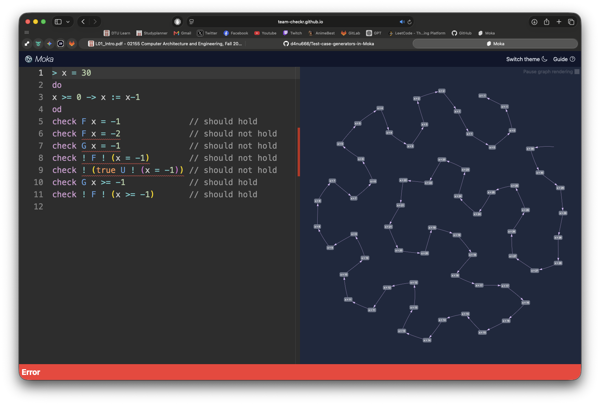
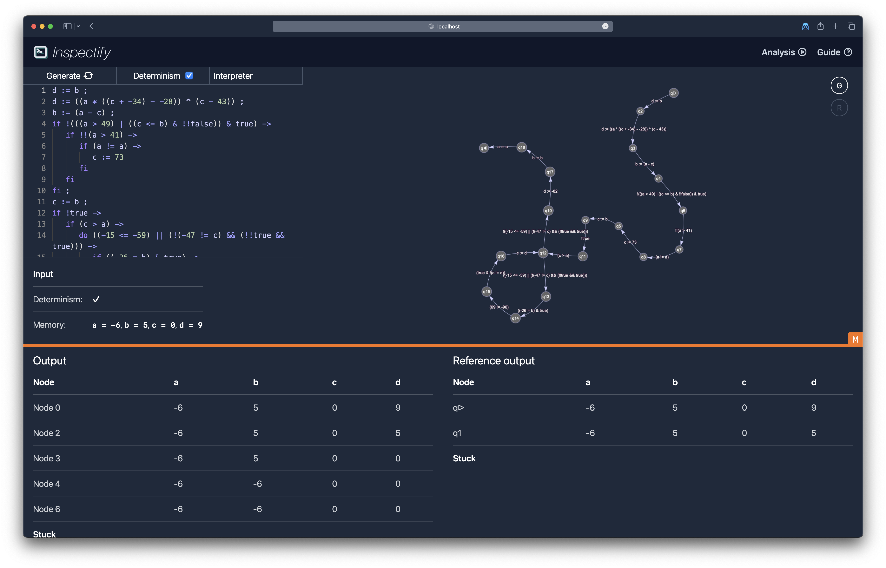

# Test Case Generators in Moka

> Bachelor thesis project — Dan (`d4nu666`), DTU.
> **Status:** in progress. *(Originally listed as: AVAILABLE, NO ONGOING STUDENT PROJECT.)*

This repository is my working fork of the [Team Checkr](https://github.com/team-checkr) toolchain
behind [Moka](https://team-checkr.github.io/), extended with test case generators.

## What is this about?

Moka is an entry-level, zero-installation tool for learning about model checking.

## What is the problem?

Moka does not have a feature to generate random test cases. Users need to rely on self-typed
examples or examples taken from teaching materials.

## What is the goal?

Design and implement test case generators for Moka.

## Why should I care?

The main aim is to provide a better learning experience for the tool's users. An additional aim is
to stress-test the tool with further testing.

## What should I know?

- Good command of model checking as taught in [02141](https://kurser.dtu.dk/course/02141).
- You need to follow the new edition of the
  [special course on Inspectify/Rust/Svelte](https://gitlab.gbar.dtu.dk/02141/2026-primr).

## What will I learn?

Automated test-case generation techniques, and a deeper look at the theory and practice of model
checking.

---

## Upstream: Checkr

### Architecture

The checkr toolchain is split up into multiple crates:

- `checkr`: Contains the fundamental types and functions for the core analysis and validation of results.
- `checko`: Contains the infrastructure code for running external implementations for the analysis.
- `inspectify`: Contains the application code for displaying analysis external implementations.

Each of the crates has a different target audience: `checko` is meant for admin tasks, such as correcting assignments, running competitions, and validating submissions in CI. `inspectify` is meant for students to interact with their analysis tool in a user-friendly way. `checkr` is the core analysis implementation, and is purely meant to be used as a dependency in other crates.

To learn more about [checko](./checko/README.md) and [inspectify](./inspectify/README.md), check out the README in their folders.
